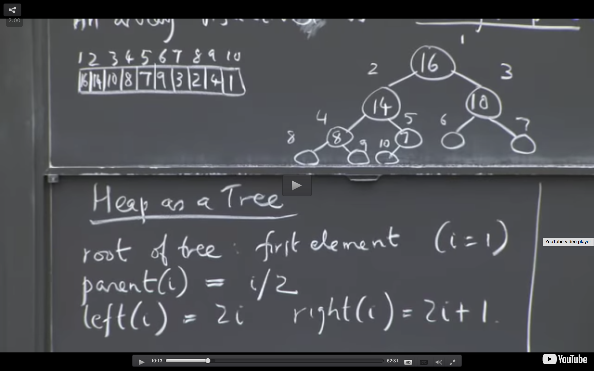

# Data Science Make Easy
### The purpose of this github repo is to put some basic topics in data science together

## Data Hanlding
[Missind data](https://www.kaggle.com/dansbecker/handling-missing-values)

[Resampling](https://medium.com/analytics-vidhya/resampling-methods-statistical-learning-8c3da6fe6d24)

[Imbalanced data](https://machinelearningmastery.com/tactics-to-combat-imbalanced-classes-in-your-machine-learning-dataset/)

___
## Statistic

[Permuations & Combinations](https://www.mathsisfun.com/combinatorics/combinations-permutations.html)

[Data distribution](https://mathbitsnotebook.com/Algebra1/StatisticsData/STShapes.html)

[maximum likelihood](https://towardsdatascience.com/probability-concepts-explained-maximum-likelihood-estimation-c7b4342fdbb1)

[hypothesis testing](https://www.statisticshowto.datasciencecentral.com/probability-and-statistics/hypothesis-testing/):
    
Z-test

t-test

Chi-sqaure test

Fisher's Exact test 

Type I error

Type II error

p value

Recall, Percision, F1 score

[Designing an Experiment, Power Analysis](http://www.statsoft.com/Textbook/Power-Analysis)

[Nonparametric statistics](https://en.wikipedia.org/wiki/Nonparametric_statistics)

[Comparing two distribution: The Kullback Leibler distance (KL) and Kolmogorov–Smirnov test (KS)](https://stats.stackexchange.com/questions/9311/kullback-leibler-vs-kolmogorov-smirnov-distance)

[Markov chain](https://en.wikipedia.org/wiki/Markov_chain)

___   
## Algorithm and Data Struture
Resource: 

Programming practice: https://practice.geeksforgeeks.org/; Hacker earth; Hacker rank; Leetcode

MIT open course: https://ocw.mit.edu/courses/electrical-engineering-and-computer-science/6-006-introduction-to-algorithms-fall-2011/lecture-videos/

Book: http://home.ustc.edu.cn/~huang83/ds/Data%20Structures%20and%20Algorithms%20Using%20Python.pdf

### Data Structure:
Heap: An array represented by an almost (unless you insert null then it is totally) compeleted binary tree. When a value is extracted and removed from the heap, it can only come from the root node. A node of a tree (i) has parents(i/2) and left node (2 * i) and right node (2 * i + 1), i starting from 1 in root.

Max Heap: The key of a node >= the key of its children




Inserting or removing a node in the max heap is O(logN) - worst case senario need to work all the way up to the root (logN levels)
Creating a max heal is O(N) by doing bottom up - building the heat from the bottom and work the way up, when you reach the top, the worst case is that node need to move all the way down, but as there is less node has large height, we can prove that it has a linear upper bound: https://www.youtube.com/watch?v=MiyLo8adrWw

Doing a heap sort is O(NlogN)

### Divide and Conquer

### Randomized Algorithm

### Greedy Algorithm: 
A loose definition Tim Roughgarden: from iteratively make "my opic" decision - decision that seems to be good at the time, and hope everyting workds out at the end. A more formal definition: A greedy algorithm is an algorithmic paradigm that follows the problem solving heuristic of making the locally optimal choice at each stage[1] with the intent of finding a global optimum. 

Many greeydy algorithm is actually not correct!

Exp: [Dijkstra's shortest path algorithm](https://www.youtube.com/watch?v=_lHSawdgXpI) It is not correct if the edge is negative. O(E + VlogV)
``` 
 1  function Dijkstra(Graph, source):
 2
 3      create vertex set Q
 4
 5      for each vertex v in Graph:             
 6          dist[v] ← INFINITY                  
 7          prev[v] ← UNDEFINED                 
 8          add v to Q                      
10      dist[source] ← 0                        
11      
12      while Q is not empty:
13          u ← vertex in Q with min dist[u]    
14                                              
15          remove u from Q 
16          
17          for each neighbor v of u:           // only v that are still in Q
18              alt ← dist[u] + length(u, v)
19              if alt < dist[v]:               
20                  dist[v] ← alt 
21                  prev[v] ← u 
22
23      return dist[], prev[]
```
If we are only interested in a shortest path between vertices source and target, we can terminate the search after line 15 if u = target. Now we can read the shortest path from source to target by reverse iteration:

    1  S ← empty sequence
    2  u ← target
    3  if prev[u] is defined or u = source:          // Do something only if the vertex is reachable
    4      while u is defined:                       // Construct the shortest path with a stack S
    5          insert u at the beginning of S        // Push the vertex onto the stack
    6          u ← prev[u]                           // Traverse from target to source

### Dynamic programming


## Machine Learning 

Books: http://faculty.marshall.usc.edu/gareth-james/ISL/ISLR%20Seventh%20Printing.pdf

https://developers.google.com/machine-learning/glossary/

https://developers.google.com/machine-learning/guides/rules-of-ml/

#### What is Machine Learning?

Arthur Samuel: "the field of study that gives computers the ability to learn without being explicitly programmed." 

Tom Mitchell: "A computer program is said to learn from experience E with respect to some class of tasks T and performance measure P, if its performance at tasks in T, as measured by P, improves with experience E."


## Deep Learning

## System design

## SQL
https://lagunita.stanford.edu/courses/DB/SQL/SelfPaced/courseware/ch-sql/seq-exercise-sql_movie_query_core/

Execise:
https://www.hackerrank.com/challenges/harry-potter-and-wands/problem
https://www.techbeamers.com/sql-query-questions-answers-for-practice/
https://www.w3schools.com/sql/sql_update.asp

Window function:
https://classroom.udacity.com/courses/ud198/lessons/fec9c33e-daea-4a5d-827e-41a09c6fe371/concepts/4c71795c-8ebf-4a3f-b951-494220b702cc

Rules for normalized tables:

1. Every row has the same number of columns.

2. There is a unique key and everything in a row says something about the key.

3. Facts that don't relate to the key belong in different tables.

4. Tables shouldn't imply relationships that don't exist.


## Case study

Resource:

https://www.analyticsvidhya.com/blog/tag/case-study/


