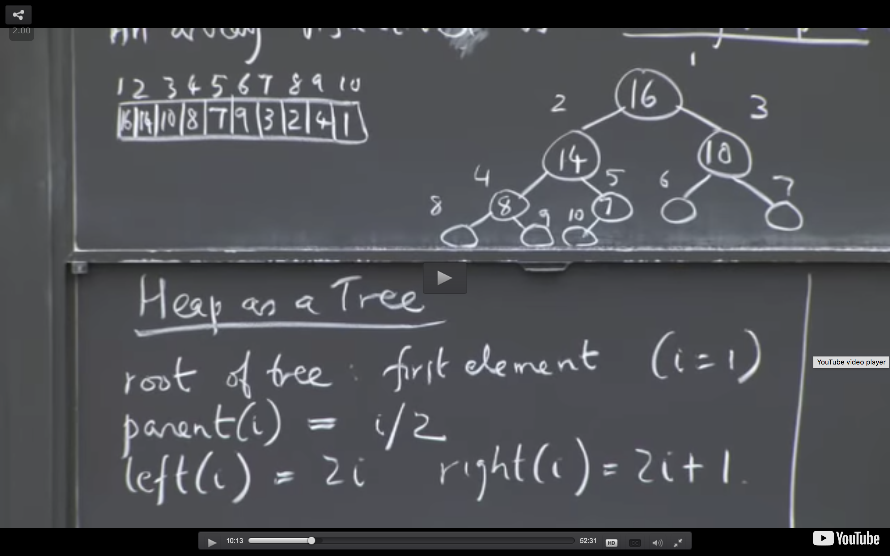

# Data Structures
Resources:

https://www.coursera.org/learn/data-structures/home/welcome

https://leetcode.com/explore/

## List

A python list contains more storage space than is needed to store the items currently in the list. This extra space, the size of which can be up to twice the necessary capacity, allows for quick and easy expansion as new items are added to the list.

## Array

A one-dimensional array is composed of multiple sequential elements stored in contiguous bytes of memory and allows for random access to the individual elements. Compared to list, to use array, you have to know the size of the array beforehand, and cannot change it later.

## Set

A set is a container that stores a collection of unique values over a given comparable domain in which the stored values have no particular ordering.

## Link List
In python, every time when you insert an element to a list, new storage of the entire list will be created and the elemenets need to be shifted to move room. This means it is quite not efficient when the list is large. Therefore, in this situation, we used link list instead, which doesn't recreate the storage neither does it require shifting. However, it does eliminate the constant time direct element access available with the array and Python list. As its name implies, the link strucutre has to been accessed based on the 'link order'. The singly linked list is a linear structure in which traversals start at the front and progress, one element at a time, to the end. Other variations include the circularly linked, the doubly linked, and the circularly doubly linked lists.

```
class Element(object):
    def __init__(self, value):
        self.value = value
        self.next = None

class LinkedList(object):
    def __init__(self, head=None):
        self.head = head
        
def append(self, new_element):
    current = self.head
    if self.head:
        while current.next:
            current = current.next
        current.next = new_element
    else:
        self.head = new_element
```

## Stack

First in last out structure. Python already has an implementation of stack using list, you can use append and pop directly.

```
>>> stack = [3, 4, 5]
>>> stack.append(6)
>>> stack.append(7)
>>> stack
[3, 4, 5, 6, 7]
>>> stack.pop()
7
>>> stack
[3, 4, 5, 6]
>>> stack.pop()
6
>>> stack.pop()
5
>>> stack
[3, 4]

```

or with a linked list, you can do 
```
def delete_first(self):
    deleted = self.head
    if self.head:
        self.head = self.head.next
        deleted.next = None
    return deleted
```

## Queue
A queue is the opposite as a stack, it is first in first out. It has a head and a detail. Adding an element from the top is called 'inqueue', removing an element from the bottom is called 'dequeue'.


## Heap
An array represented by an almost (unless you insert null then it is totally) compeleted binary tree. When a value is extracted and removed from the heap, it can only come from the root node. A node of a tree (i) has parents(i/2) and left node (2 * i) and right node (2 * i + 1), i starting from 1 in root.

Max Heap: The key of a node >= the key of its children




Inserting or removing a node in the max heap is O(logN) - worst case senario need to work all the way up to the root (logN levels)
Creating a max heal is O(N) by doing bottom up - building the heat from the bottom and work the way up, when you reach the top, the worst case is that node need to move all the way down, but as there is less node has large height, we can prove that it has a linear upper bound: https://www.youtube.com/watch?v=MiyLo8adrWw

Doing a heap sort is O(NlogN)


## Acknowledgement:
https://github.com/joeyajames/Python/tree/master/LinkedLists


